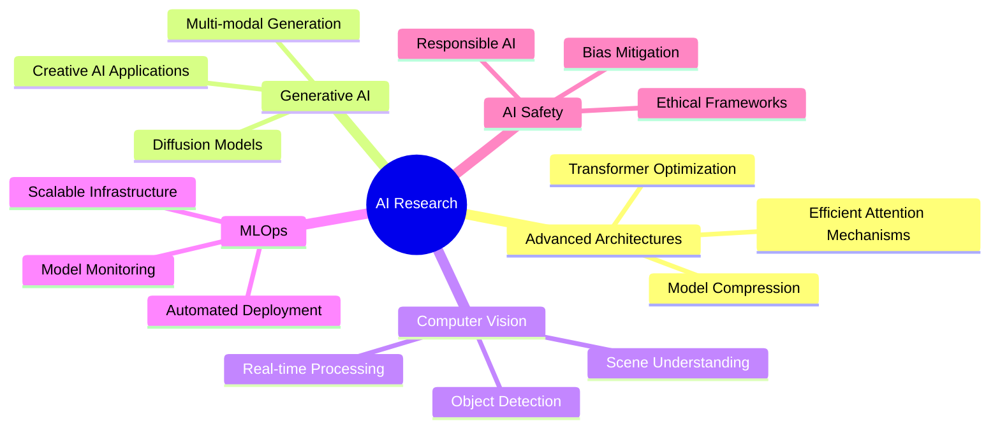

# Manav Sutar

<div align="center">


[](https://www.linkedin.com/in/manavsutar)
[](https://github.com/TheCoder2010-create)
[](https://twitter.com/manavsutar)
[](https://kaggle.com/manavsutar)
[](https://manavsutar.dev)
[](mailto:sutarmanav557@gmail.com)


</div>

---

## 👨‍💻 About Me

```python
class GenAIEngineer:
    def __init__(self):
        self.name = "Manav Sutar"
        self.role = "GenAI Engineer & ML Specialist"
        self.location = "Pune, Maharashtra, India 🇮🇳"
        self.expertise = ["NLP", "Computer Vision", "LLMs", "MLOps"]
        
    def get_current_focus(self):
        return [
            "Developing production-ready AI solutions",
            "Fine-tuning Large Language Models",
            "Building scalable ML infrastructure",
            "Optimizing model performance and deployment"
        ]
    
    def get_achievements(self):
        return {
            "model_accuracy": "95%+",
            "daily_requests": "10,000+",
            "efficiency_improvement": "40%"
        }
```

**Professional Focus Areas:**
- 🤖 Generative AI & Large Language Model Development
- 👁️ Computer Vision & Real-Time Image Processing
- 🔄 End-to-End MLOps & Model Deployment
- ☁️ Cloud-Based AI Infrastructure
- 💬 Natural Language Processing & Conversational AI

---

## 🛠️ Technology Stack

<div align="center">

### Core AI/ML


### Data Science


### NLP & Transformers


### Cloud Platforms


### DevOps & MLOps


### Databases


### Backend & APIs


### Tools & Platforms


</div>

---

## üìä GitHub Statistics

<div align="center">
  
  
</div>

<div align="center">
  
</div>

<div align="center">
  
</div>


## 🔬 Current Research & Learning


```mermaid
mindmap
  root((AI Research))
    Advanced Architectures
      Transformer Optimization
      Efficient Attention Mechanisms
      Model Compression
    Generative AI
      Diffusion Models
      Multi-modal Generation
      Creative AI Applications
    Computer Vision
      Object Detection
      Scene Understanding
      Real-time Processing
    MLOps
      Scalable Infrastructure
      Model Monitoring
      Automated Deployment
    AI Safety
      Responsible AI
      Bias Mitigation
      Ethical Frameworks
```

**Active Learning Areas:**
- 🏗️ Advanced Transformer Architectures & Efficient Training
- üé® Diffusion Models & Creative AI Applications
- 🔄 Multi-Modal AI Systems (Text, Vision, Audio)
- ‚ö° Model Quantization & Edge Deployment
- üåê Distributed Training & Scalability
- üîê AI Safety, Ethics & Responsible AI Practices

---

## 💼 Professional Services

<div align="center">

### Open for Collaboration

| Service | Description |
|---------|-------------|
| 🤝 **AI Consulting** | Strategic guidance on AI/ML implementation |
| üí° **Project Collaboration** | Joint research and development initiatives |
| 🎤 **Speaking Engagements** | Tech talks and conference presentations |
| 👨‍🏫 **Mentorship** | Guiding aspiring AI engineers |
| 🔬 **Research Partnerships** | Academic and industry collaborations |

</div>

---

## üì´ Let's Connect

<div align="center">

**Interested in AI innovation, collaboration, or just want to chat about the latest in ML?**

[](https://www.linkedin.com/in/manavsutar)
[](mailto:sutarmanav557@gmail.com)
[](https://twitter.com/manavsutar)
[](https://manavsutar.dev)

### 💬 Available For:
‚úÖ AI/ML Project Collaborations | ‚úÖ Technical Consulting | ‚úÖ Research Partnerships  
‚úÖ Speaking Engagements | ‚úÖ Mentorship | ‚úÖ Open Source Contributions

</div>

---

<div align="center">

### üìà Contribution Timeline


---

**"Building intelligent systems that transform ideas into reality"** üöÄ


</div>
